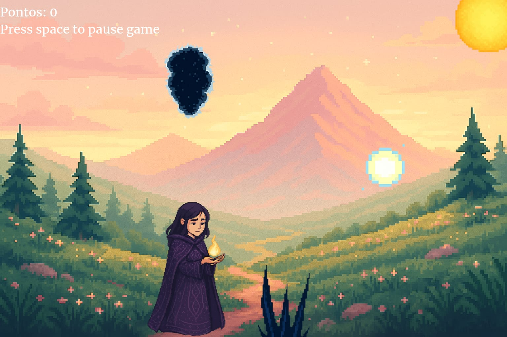

# A Jornada de Luz! 🔥

### Desenvolvido por:
*Jamile Rockenbach Ferreira* 
*RA: 1137704*
---
### Sobre o jogo:
*A Jornada de Luz é um jogo que une arte e emoção para guiar o jogador por uma experiência simbólica de superação, você acompanha a Lúmina coletando orbes de felicidade e desviando de obstáculos que refletem suas dificuldades emocionais. Com objetivo de ajudar a personagem a encontrar seu equilíbrio, tranquilidade e paz interior.*
---
### Propósito:
*Mais do que um jogo de aventura, A Jornada de Luz foi criado com a intenção de acolher o jogador e oferecer uma experiência sensível e reflexiva. Cada elemento visual, sonoro e mecânico foi pensado para transmitir calma, coragem e superação!*
---
### Tecnologias Utilizadas:
*Python* - Linguagem principal do projeto.

*Pygame* - Criação da lógica e do ambiente gráfico do jogo. 

*Tkinter* -Interface gráfica do menu, tutorial, objetivos e histórico.

*SpeechRecognition + Pyaudio* - Captura e interpreta o nome do jogador por voz.

*Pyttsx3* - Sintese de voz utilizada para capturar o nome do jogador.

*Datatime* - Utilizado para capturar a data e a hora quando o jogador for jogar

*Random* - Randomizar os espinhos no jogo e nas frases no final.
---

